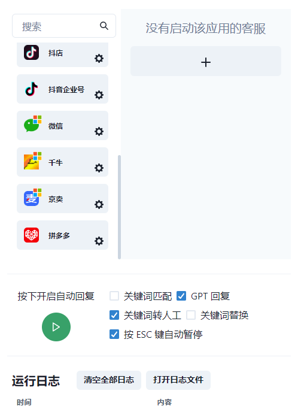

<div align="center">

<a href="https://doc.lazaytools.top/"></a>

## 懒人客服

<p align="center">
  <a href="./README_EN.md">English</a> |
  <a href="./README.md">简体中文</a>
</p>

懒人客服是一个基于 LLM 大语言模型的知识库的集成客服系统，提供开箱即用的智能客服解决方案，支持微信、千牛、哔哩哔哩、抖音企业号、抖音、抖店、拼多多、微博聊天、小红书专业号运营、小红书、知乎等平台接入，支持文本、语音和图片，通过插件访问操作系统和互联网等外部资源，支持基于自有知识库定制企业 AI 应用.

</div>

<p align="center">
  <a href="https://github.com/cs-lazy-tools/ChatGPT-On-CS/releases">
    
  </a>
  <a href="https://doc.lazaytools.top/">
    
  </a>
  <a href="https://github.com/cs-lazy-tools/ChatGPT-On-CS/blob/main/BUILD.md">
    
  </a>
  <a href="https://github.com/cs-lazy-tools/ChatGPT-On-CS/blob/main/LICENSE">
    
  </a>
</p>

|                                    |                                    |
| ---------------------------------- | ---------------------------------- |
|          |  |

注：本项目只是一个用于对接外部平台的客服工具，不提供任何平台的账号，需要自行准备。并且知识库功能也需要自行准备，该项目目前只支持的 OpenAI 的 API 接口（或代理）接入

* [GitHub] https://github.com/cs-lazy-tools/ChatGPT-On-CS
* [Gitee] https://gitee.com/alsritter/ChatGPT-On-CS · (国内用户推荐)

## 主要功能
- [x] 多平台支持：当前支持微信、千牛、哔哩哔哩、抖音企业号、抖音、抖店、微博聊天、小红书专业号运营、小红书、知乎等平台，未来将不断扩展支持更多社交媒体平台.
- [x] 预设回复内容：允许用户设置自定义回复，以应对常见问题，提高回复效率.
- [x] 接入ChatGPT接口，根据客户的咨询内容智能生成回复，适用于处理复杂或者个性化的客户咨询.
- [x] 发送图片和二进制文件：支持发送图片等二进制文件，满足多样化的客户服务需求.
- [x] 知识库： 通过上传知识库文件自定义专属机器人，可作为数字分身、智能客服、私域助手使用.
- [x] 各个平台独立的插件系统，支持插件访问操作系统和互联网等外部资源，支持基于自有知识库定制企业 AI 应用.


## 演示视频
[观看视频](https://www.bilibili.com/video/BV1qz421Q73S)

## 社区交流群
如果有问题需要反馈，或者对项目有什么特性希望支持的，可以添加小助手微信加入开源项目交流群：


## 下载地址

<a href="https://github.com/cs-lazy-tools/ChatGPT-On-CS/releases/download/v1.2.0/1.2.0.exe" style="display: inline-block; background-color: #008CBA; color: white; padding: 10px 20px; text-align: center; text-decoration: none; font-weight: bold; border-radius: 5px; margin: 4px 2px; cursor: pointer;">点击下载</a>

如果网络环境导致下载不了，可以使用下面的地址下载：

```txt
https://down.wizgadg.top/chatgpt-on-cs
```

## 使用说明
可以参考 [使用说明](https://doc.lazaytools.top/) 文档

## 项目计划 RoadMap
- [x] 支持微信平台的基础聊天功能
- [x] 支持千牛平台的基础聊天功能
- [x] 支持京麦平台的基础聊天功能
- [x] 添加关闭自动回复，只使用关键词回复的功能
- [x] 添加延时随机时间
- [x] 优化各个平台的独立配置功能
- [x] 支持 Excel 导入回复内容
- [x] 支持导出回复内容到 Excel
- [x] 优化千牛的对接模式
- [x] 优化微信平台的回复速度
- [x] 添加中文路径的支持
- [x] 支持自动检测人类操作后自动暂停项目
- [ ] 新增 wx 群聊需要使用 @ 机器人才能回复的功能
- [x] 支持浏览器多开功能
- [x] 支持导出聊天记录到 Excel
- [ ] 支持关键词匹配测试功能
- [x] 实现小红书回复后，自动私聊的功能
- [ ] 支持抖音直播平台自动回复功能
- [ ] 支持拼多多
- [ ] 支持多平台文章自动发送功能
- [ ] 支持本地聊天模型的加载


## 🤝 参与贡献
我们热烈欢迎各种形式的贡献。假如你对编写代码有兴趣，不妨浏览我们的 GitHub Issues，选择一个你感兴趣的问题，尽情发挥你的创造力和技术才能，向我们展示你独特的解决方案。此外，我们也鼓励大家提出新想法、改进建议，或参与讨论，共同推动项目的发展。

<!-- Copy-paste in your Readme.md file -->

<a href="https://next.ossinsight.io/widgets/official/compose-recent-active-contributors?repo_id=768534013&limit=30" target="_blank" style="display: block" align="center">
  <picture>
    <source media="(prefers-color-scheme: dark)" srcset="https://next.ossinsight.io/widgets/official/compose-recent-active-contributors/thumbnail.png?repo_id=768534013&limit=30&image_size=auto&color_scheme=dark" width="655" height="auto">
    
  </picture>
</a>

<!-- Made with [OSS Insight](https://ossinsight.io/) -->

<!-- Copy-paste in your Readme.md file -->

<a href="https://next.ossinsight.io/widgets/official/compose-org-participants-growth?activity=new&period=past_28_days&owner_id=169274333" target="_blank" style="display: block" align="center">
  <picture>
    <source media="(prefers-color-scheme: dark)" srcset="https://next.ossinsight.io/widgets/official/compose-org-participants-growth/thumbnail.png?activity=new&period=past_28_days&owner_id=169274333&image_size=4x7&color_scheme=dark" width="657" height="auto">
    
  </picture>
</a>

<!-- Made with [OSS Insight](https://ossinsight.io/) -->

## 🌟 Star History

<a href="https://star-history.com/#cs-lazy-tools/ChatGPT-On-CS&Date">
 <picture>
   <source media="(prefers-color-scheme: dark)" srcset="https://api.star-history.com/svg?repos=cs-lazy-tools/ChatGPT-On-CS&type=Date&theme=dark" />
   <source media="(prefers-color-scheme: light)" srcset="https://api.star-history.com/svg?repos=cs-lazy-tools/ChatGPT-On-CS&type=Date" />
   
 </picture>
</a>

<a href="#readme">
    
</a>


## 使用协议
本仓库遵循 [AGPL-3.0 开源协议](./LICENSE)。

1. 允许个人使用，如果需要商业使用，请联系作者。
2. 除非获得商业授权，否则无论以何种方式修改或者使用代码，都需要开源，并保留相关版权信息。
3. 详细内容请参见 [AGPL-3.0 开源协议](./LICENSE)。
4. 联系请加上面的小助手，或者在 GitHub 上提 issue。