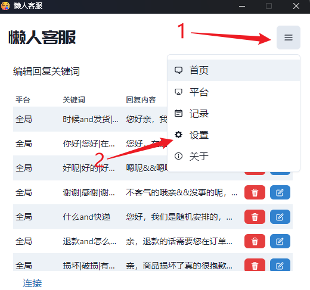
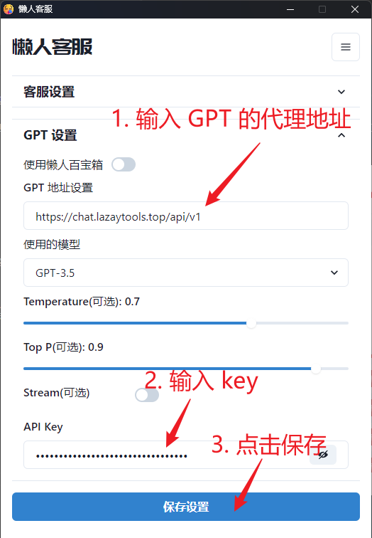
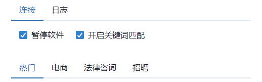
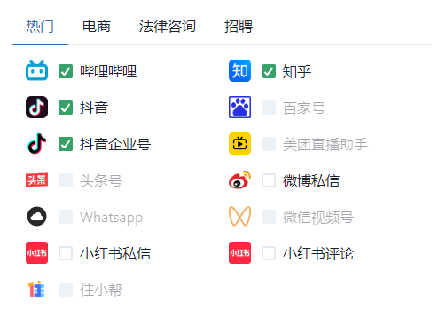
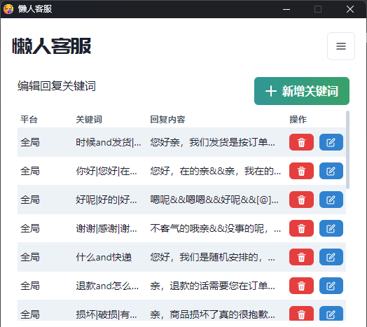
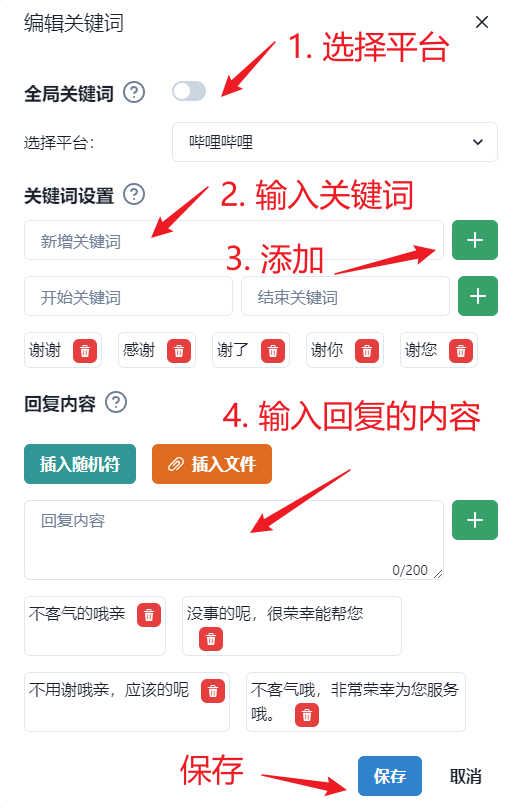
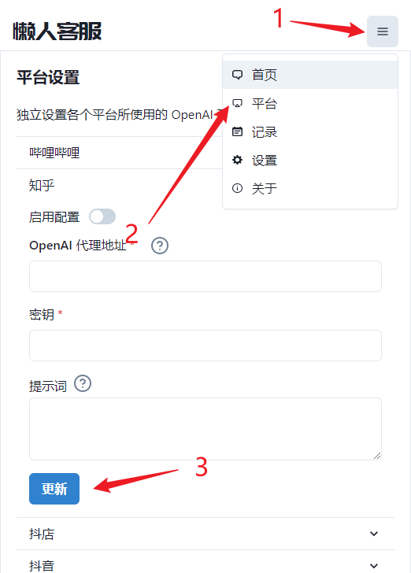
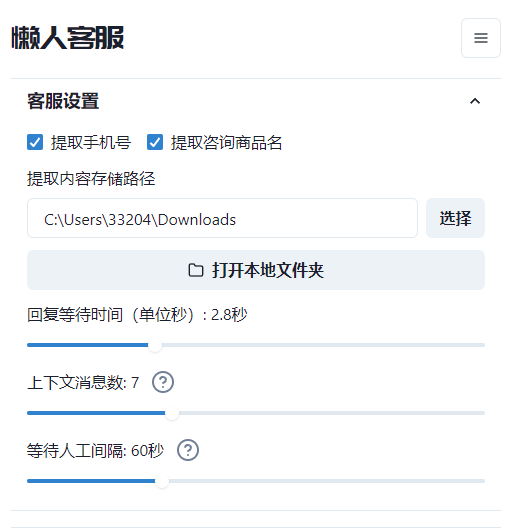

## 懒人客服
[English](README_EN.md) · **中文** 

本项目是基于大模型的智能对话客服工具，支持微信、千牛、哔哩哔哩、抖音企业号、抖音、抖店、微博聊天、小红书专业号运营、小红书、知乎等平台接入，可选择 GPT3.5/GPT4.0（后续会支持更多平台），能处理文本、语音和图片，通过插件访问操作系统和互联网等外部资源，支持基于自有知识库定制企业 AI 应用.

注：本项目只是一个用于对接外部平台的客服工具，不提供任何平台的账号，需要自行准备。并且知识库功能也需要自行准备，该项目目前只支持的 OpenAI 的 API 接口（或代理）接入

* [GitHub] https://github.com/lrhh123/ChatGPT-On-CS
* [Gitee] https://gitee.com/alsritter/ChatGPT-On-CS · (国内用户推荐)

## 主要功能
- [x] 多平台支持：当前支持微信、千牛、哔哩哔哩、抖音企业号、抖音、抖店、微博聊天、小红书专业号运营、小红书、知乎等平台，未来将不断扩展支持更多社交媒体平台.
- [x] 预设回复内容：允许用户设置自定义回复，以应对常见问题，提高回复效率.
- [x] 接入ChatGPT接口，根据客户的咨询内容智能生成回复，适用于处理复杂或者个性化的客户咨询.
- [x] 发送图片和二进制文件：支持发送图片等二进制文件，满足多样化的客户服务需求.
- [x] 知识库： 通过上传知识库文件自定义专属机器人，可作为数字分身、智能客服、私域助手使用.
- [x] 各个平台独立的插件系统，支持插件访问操作系统和互联网等外部资源，支持基于自有知识库定制企业 AI 应用.


## 演示视频
[观看视频](https://www.bilibili.com/video/BV1qz421Q73S)

## 开源社区
如果有问题需要反馈，或者对项目有什么特性希望支持的，可以添加小助手微信加入开源项目交流群：


<!-- 
## 商业支持
我们还提供企业级的 AI应用平台，包含知识库、Agent插件、应用管理等能力，支持多平台聚合的应用接入、客户端管理、对话管理，以及提供 SaaS服务、私有化部署、稳定托管接入 等多种模式.

目前已在私域运营、智能客服、企业效率助手等场景积累了丰富的 AI 解决方案， 在电商、文教、健康、新消费等各行业沉淀了 AI 落地的最佳实践，致力于打造助力中小企业拥抱 AI 的一站式平台。 企业服务和商用咨询可联系产品顾问：

 -->


## 下载地址

<a href="https://github.com/lrhh123/ChatGPT-On-CS/releases/download/v1.0.2/1.0.2.exe" style="display: inline-block; background-color: #008CBA; color: white; padding: 10px 20px; text-align: center; text-decoration: none; font-weight: bold; border-radius: 5px; margin: 4px 2px; cursor: pointer;">点击下载</a>

如果网络环境导致下载不了，可以使用百度云盘下载：

```txt
链接：https://pan.baidu.com/s/1sGAgyTv1KGRCg6ekUf_sqg?pwd=6666 
提取码：6666
```

## 使用说明
第一次启动时可能会有点慢，因为它需要先下载驱动文件和初始化回复数据库，所以请耐心等待.

### 1、设置 GPT 地址

启动程序后，点击设置按钮，设置好你的 OpenAPI Key 和 代理服务器地址，然后点击保存.






### 2、首页操作说明
首先可以看到首页这里的 “连接” 项，有两个勾选框，默认是暂停软件的，如果你想让软件开始工作，就把这个勾选框去掉



当第一次打开时，默认是没有任何的登录态的，所以会需要你手动暂停一下，然后登录后再，再取消勾选暂停，让它开始工作



自动回复开启后它就会读取你下面勾选的平台，自动打开该页面开始工作。注意上面部分的勾选框无法点击，是因为作者没有相关平台的账号，所以无法登录调试该平台的信息，如果你有相关平台的账号并且想要支持该平台的自动回复,可以联系上面的客服.

### 3、关键词的编写
当上面的 “开启关键词匹配” 勾选后，会优先匹配这里设置的关键词，如果匹配到了关键词，就会回复关键词的回复内容，当没有匹配上关键词的问题，则会调用你提供的 ChatGPT API 去询问 GPT 回答用户问题.



点击 “新增关键词” 按钮可以自定义关键词和回复内容.



可以添加若干个用于匹配的关键词

**关键词的编写规则**
- `你好`：只要用户输入的内容为`你好`时则会回复你设置的回复内容.

- `你好*`：模糊匹配使用 `*` 符号，例如 `你好*`，那么只要用户输入的内容以 `你好` 开头就会回复你设置的回复内容.

- `*你好*`:设置的关键词为 `*你好*`，那么只要用户输入的内容中包含 `你好` 就会回复你设置的回复内容.

**比较特殊的**：如果使用下面的 “开始关键词” 和 “结束关键词” 时，那么只要用户输入的内容以 “开始关键词” 开头，并且以 “结束关键词” 结尾，就能匹配上你设置的关键词.

### 4、回复的编写
- `关键词规则：`可以对应多条回复内容，当匹配到关键词时，会随机选择一条作为回复内容.

- `插入随机符：` 是因为在拼多多平台等平台，是不允许每次重复一个回答的，所以可以插入一个随机符，以规避这个问题.

- `插入文件：` 则主要是用于插入图片，可以插入图片的链接，这样就可以回复图片了

### 5、平台独立的 ChatGPT API 设置
有时候，我们可能需要针对不同的平台设置不同的 ChatGPT API 地址，这时候就可以在这里设置。你可以基于 [懒人百宝箱](https://chat.lazaytools.top/) 实现自己的知识库，然后设置到这里。



当设置了平台单独的 ChatGPT API 地址后，就会优先使用这个地址去调用 ChatGPT API，如果没有设置，则会使用上面设置的全局 ChatGPT API 地址。

### 6、客服相关设置


**提取信息**：勾选提取手机号或者提取咨询商品名后，它会去提取用户消息中的手机号或者商品名，然后将它存储到下面的路径中。

**等待回复时间**：当用户发送消息后，会等待这么长时间后再回复用户，如果希望马上回复，可以将这个值设置成零。

**上下文消息数**：当前使用 ChatGPT API 时，会将指定数量的聊天上下文，拿去调用 ChatGPT API，以便 ChatGPT API 更好的理解用户的问题。注意，这个值设置的越大，调用 ChatGPT API 的速度就会越慢。

**等待人工间隔**：当遇到 ChatGPT 阻塞的时候，会等待这么长时间然后终止客服自动任务，转交给人工客服手动处理。

## 项目计划
- [x] 支持微信平台的基础聊天功能
- [x] 支持千牛平台的基础聊天功能
- [x] 支持京麦平台的基础聊天功能
- [ ] 支持多平台文章自动发送功能
- [ ] 添加关闭自动回复，只使用关键词回复的功能
- [ ] 添加延时随机时间
- [ ] 优化各个平台的独立配置功能
- [ ] 支持 Excel 导入回复内容
- [ ] 支持导出回复内容到 Excel
- [ ] 支持导出聊天记录到 Excel
- [ ] 添加中文路径的支持
- [ ] 优化微信平台的回复速度
- [ ] 支持企业微信外部群聊天功能
- [ ] 支持企业微信自动加人功能
- [ ] 支持自动检测人类操作后自动暂停项目
- [ ] 支持抖音直播平台自动回复功能
- [ ] 支持拼多多
- [ ] 支持本地聊天模型的加载
