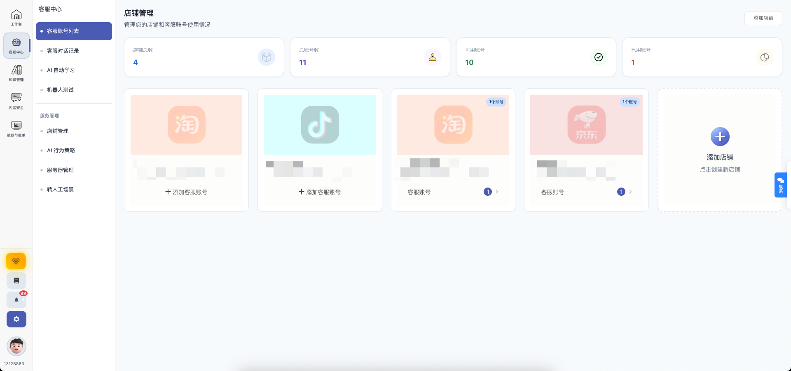
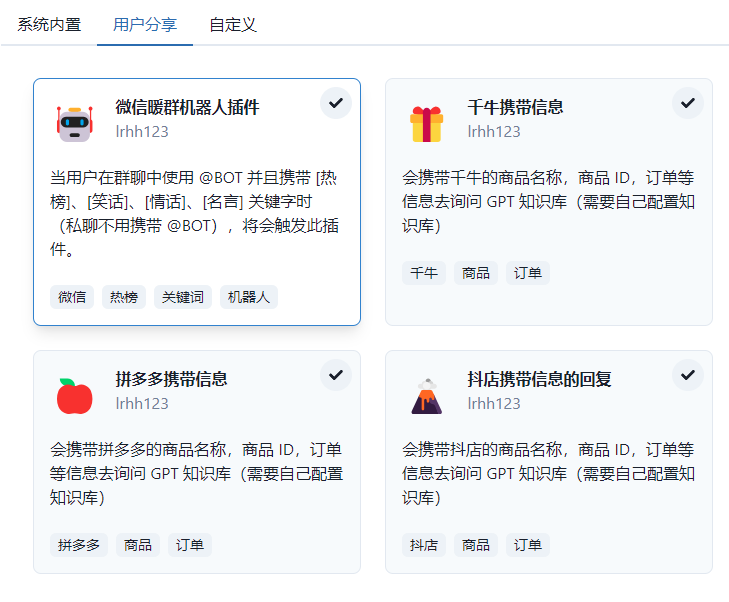
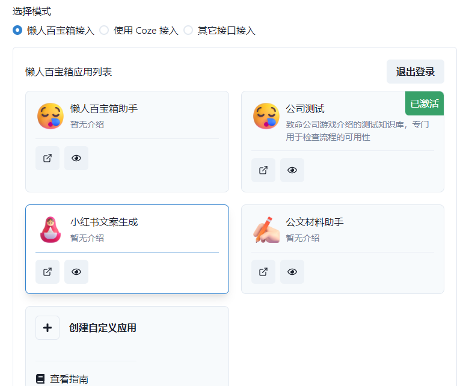
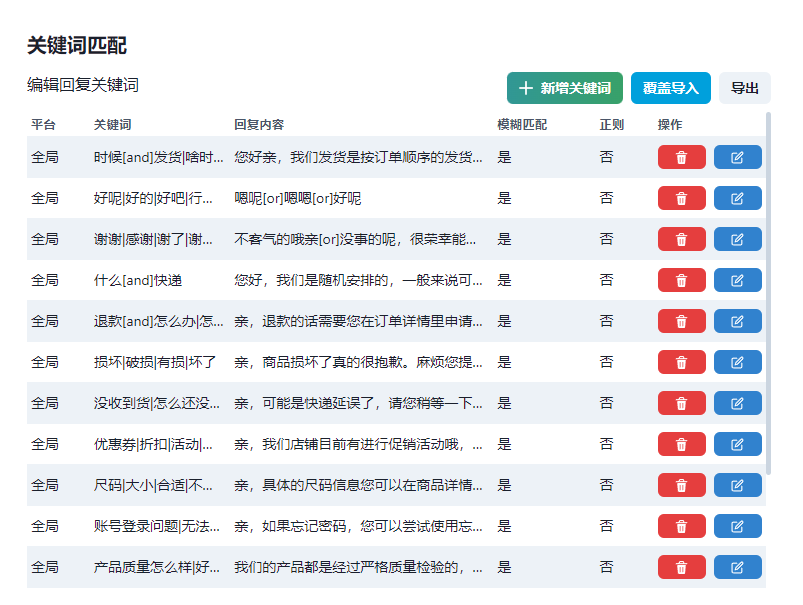
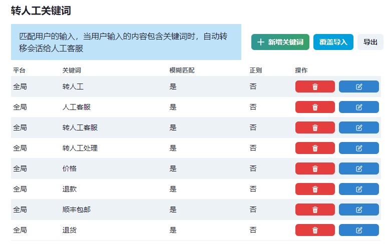
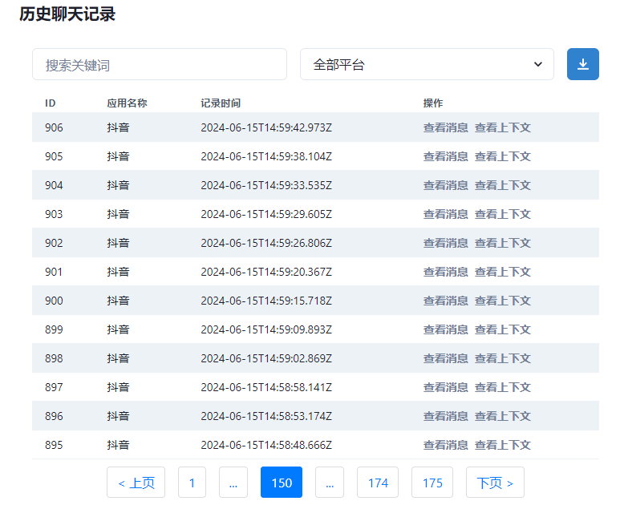

⚡ **专业的通用电商 SaaS 智能客服平台** ⚡

金销数据云智能客服是基于大语言模型（LLM）打造的专业电商客服 SaaS 解决方案，专为电商行业量身定制。无缝对接主流电商平台，支持微信、千牛、抖音、飞鸽、拼多多、小红书、京东、淘宝、京麦等多平台统一管理，让您的客服工作更智能、更高效！

🌟 **在线体验**: [https://chat.xingsuancn.com/](https://chat.xingsuancn.com/)

  
  
  

## 🚀 产品特色

### 💡 为什么选择金销数据云智能客服？

- 🎯 **专注电商场景**：深度理解电商业务需求，提供针对性解决方案
- 🔗 **多平台一体化**：统一管理多个电商平台的客服工作，提升运营效率
- 🤖 **AI 驱动**：基于先进的大语言模型，智能理解客户需求，提供专业回复
- 📊 **数据洞察**：丰富的数据分析功能，助力业务决策优化
- 🛠 **灵活定制**：支持个性化配置，满足不同业务场景需求

本项目支持 GPT3.5/GPT4.0/通义千问/文心一言/DeepSeek 等主流大模型，能处理文本、语音和图片，通过插件访问操作系统和互联网等外部资源，支持基于自有知识库定制企业 AI 应用。

**📍 项目地址**
* [GitHub] https://github.com/cs-lazy-tools/ChatGPT-On-CS
* [Gitee] https://gitee.com/alsritter/ChatGPT-On-CS （国内用户推荐）

## ✨ 核心功能

### 🔥 主要特性

- ✅ **全平台覆盖**：支持微信、千牛、哔哩哔哩、抖音企业号、抖音、抖店、拼多多、微博聊天、小红书专业号运营、小红书、知乎等主流电商平台
- ✅ **智能问答**：基于 AI 大模型，智能理解客户咨询，自动生成专业回复
- ✅ **预设回复**：支持自定义常见问题回复模板，提升客服响应效率
- ✅ **多媒体支持**：支持文本、语音、图片等多种消息类型的智能处理
- ✅ **知识库定制**：上传专属知识库文件，打造个性化智能客服机器人
- ✅ **插件生态**：丰富的插件系统，支持访问外部资源和自定义功能扩展
- ✅ **数据分析**：完整的客服数据统计和分析功能，助力业务优化

### 🎬 演示视频
[📺 观看产品演示视频](https://www.bilibili.com/video/BV1qz421Q73S)

## 📸 产品展示

|  |  |
| :---: | :---: |
| **多平台管理** | **一键商品同步** |

|  |  |
| :---: | :---: |
| **高度自定义知识库** | **一键学习真人客服聊天记录** |

|  |  |
| :---: | :---: |
| **售后咨询分析** | **意图识别详细数据** |

## 🤝 OEM 合作伙伴招募

### 🌟 寻找优质合作伙伴

我们正在寻找有实力的合作伙伴进行 **OEM 贴牌合作**！如果您：

- 🎯 拥有电商行业客户资源或渠道
- 💼 具备 SaaS 产品推广经验
- 🌐 有意向打造自主品牌的智能客服产品
- 📈 希望拓展 AI 客服业务线

**我们提供：**
- ✨ 成熟稳定的技术方案
- 🎨 灵活的品牌定制服务  
- 💰 优厚的合作分成政策
- 🛠 完善的技术支持体系
- 📚 专业的培训和文档支持

**联系我们开启合作之旅！** 👇

## 📞 联系我们

### 💬 技术支持与商务合作

有任何问题需要反馈，或者对产品有特性建议，欢迎联系我们：

**🔥 扫码添加客服进群交流**

**🌐 在线体验**: [https://chat.xingsuancn.com/](https://chat.xingsuancn.com/)

## 📖 使用指南

详细的使用教程和配置说明，请参考：[📘 官方文档](https://kcn6j8kpei52.feishu.cn/wiki/NuoIwmhsVidJbIkQ7Iicqe5enbc)

## 🗓 产品路线图

### ✅ 已完成功能

- [x] 微信平台基础聊天功能
- [x] 千牛平台集成与优化
- [x] 京麦平台支持
- [x] 多多平台支持
- [x] 关键词回复与自动回复开关
- [x] 延时随机回复功能
- [x] 多平台独立配置
- [x] Excel 批量导入导出回复内容
- [x] 中文路径支持优化
- [x] 人工接管自动检测
- [x] 微信群聊 @ 机器人功能
- [x] 浏览器多开支持
- [x] 聊天记录导出功能
- [x] 小红书自动私聊功能
- [x] 拼多多平台集成
- [x] 关键词匹配测试工具

### 🔄 开发中功能
- [ ] 抖音直播平台自动回复
- [ ] 多平台内容自动发布
- [ ] 本地大模型支持

## 💡 开源贡献

我们热烈欢迎各种形式的贡献！无论是代码优化、功能建议还是问题反馈，都是推动项目发展的重要力量。

**参与方式：**
- 🐛 提交 Issue 报告问题或建议
- 🔧 提交 Pull Request 贡献代码
- 📝 完善文档和使用指南
- 💬 参与社区讨论和交流

### 👥 活跃贡献者

<!-- Copy-paste in your Readme.md file -->

<a href="https://next.ossinsight.io/widgets/official/compose-recent-active-contributors?repo_id=768534013&limit=30" target="_blank" style="display: block" align="center">
  <picture>
    <source media="(prefers-color-scheme: dark)" srcset="https://next.ossinsight.io/widgets/official/compose-recent-active-contributors/thumbnail.png?repo_id=768534013&limit=30&image_size=auto&color_scheme=dark" width="655" height="auto">
    
  </picture>
</a>

<!-- Made with [OSS Insight](https://ossinsight.io/) -->

<!-- Copy-paste in your Readme.md file -->

<a href="https://next.ossinsight.io/widgets/official/compose-org-participants-growth?activity=new&period=past_28_days&owner_id=169274333" target="_blank" style="display: block" align="center">
  <picture>
    <source media="(prefers-color-scheme: dark)" srcset="https://next.ossinsight.io/widgets/official/compose-org-participants-growth/thumbnail.png?activity=new&period=past_28_days&owner_id=169274333&image_size=4x7&color_scheme=dark" width="657" height="auto">
    
  </picture>
</a>

<!-- Made with [OSS Insight](https://ossinsight.io/) -->

## 📈 项目数据

<a href="https://star-history.com/#cs-lazy-tools/ChatGPT-On-CS&Date">
 <picture>
   <source media="(prefers-color-scheme: dark)" srcset="https://api.star-history.com/svg?repos=cs-lazy-tools/ChatGPT-On-CS&type=Date&theme=dark" />
   <source media="(prefers-color-scheme: light)" srcset="https://api.star-history.com/svg?repos=cs-lazy-tools/ChatGPT-On-CS&type=Date" />
   
 </picture>
</a>

## ⚖️ 使用协议

本项目遵循 [AGPL-3.0 开源协议](./LICENSE)

**协议要点：**
1. ✅ **个人使用**：完全免费，无任何限制
2. 💼 **商业使用**：需要联系我们获得商业授权
3. 📝 **代码修改**：除非获得商业授权，任何修改都需要开源并保留版权信息
4. 🔗 **详细条款**：请查阅完整的 [AGPL-3.0 协议](./LICENSE)

**商业授权咨询**：请通过上述联系方式与我们沟通

---

**⭐ 如果这个项目对您有帮助，请不要忘记给我们一个 Star！⭐**

**🚀 立即体验：[https://chat.xingsuancn.com/](https://chat.xingsuancn.com/) 🚀**

